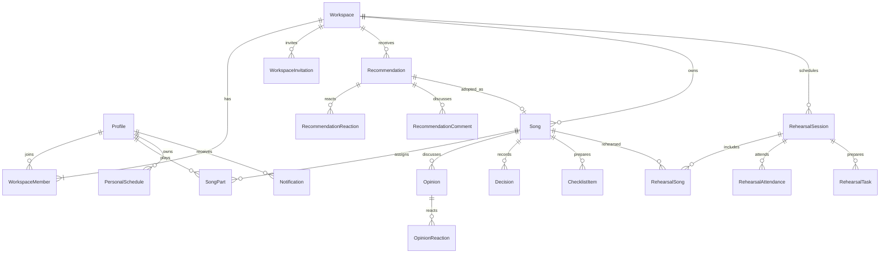
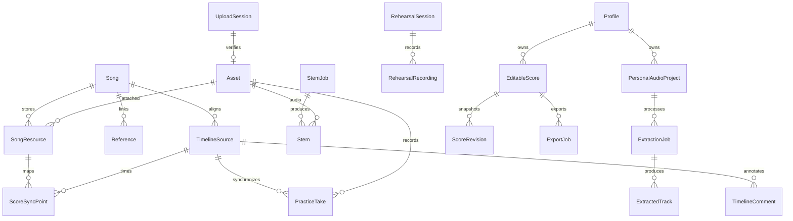

# 서비스 데이터 모델

기준일: 2026-09-28. **목표 논리 모델**이며 Prisma migration이 아니다.
실제 저장 구조의 원본은 [schema.prisma](../apps/server/prisma/schema.prisma)다.
API 필드 형식은 [OpenAPI](../apps/server/openapi.yaml), 경로는 [API 목록](../apps/server/docs/api-catalog.md)을 따른다.

## 1. 현재 저장 구조와 전환 방향

| 현재 Prisma 모델            | 현재 역할                                      | 목표                                              |
| --------------------------- | ---------------------------------------------- | ------------------------------------------------- |
| Profile                     | 인증 UUID와 표시 이름                          | 유지, 프로필 생성 흐름 통일                       |
| Workspace / WorkspaceMember | 밴드·역할·파트                                 | 유지, 밴드 설정과 곡별 배정 분리                  |
| WorkspaceInvitation         | 해시된 초대 토큰·만료·철회                     | 유지, 발급자와 수락 이력 추가 검토                |
| WorkspaceDocument           | 추천·곡·합주·의견 등을 key/value JSON으로 저장 | 아래 개별 엔터티로 점진 이관                      |
| MediaAsset                  | 개인/밴드 파일 메타데이터                      | Asset + UploadSession + 도메인별 첨부 관계로 분리 |
| SeparationJob               | 선택 악기와 나머지 WAV를 만드는 작업           | 일반 Stem과 개인 추출 작업을 구분                 |
| Notification                | 개인 알림함                                    | 유지, 대상 종류·대상 ID·이벤트 키 추가            |
| PersonalSchedule            | 개인 일정 JSON                                 | 날짜·시간·소유자를 명시한 테이블로 전환           |

JSON은 구조화 악보 본문, 편집 설정, 작업 모델 설정처럼 가변 구조에 남긴다.
검색·권한·관계·동시 수정이 중요한 추천, 반응, 곡, 참석자, 일정은 개별 행으로 관리한다.

## 2. 공통 필드와 관계 규칙

- 특별히 표시하지 않은 엔터티는 UUID `id`, `createdAt`, `updatedAt`을 가진다.
- 정식 사용자 UUID는 서버가 발급하며 서비스 JWT의 `sub`에 담는다. `auth_identities`의 (provider, providerUserId) 복합 키가 카카오 ID와 Profile UUID를 연결하고, `auth_sessions`는 세션 ID·사용자·만료를 기록해 로그아웃 토큰을 차단한다. 두 테이블은 선택된 주 DB에 저장된다. 비밀번호를 받거나 저장하지 않는다. 개발 임시 사용자는 `data/auth.db`에서 발급한 UUID이며, 세션과 계정 복구 키는 hash로 저장한다. 임시 데이터의 카카오 계정 자동 이관은 제공하지 않는다.
- 밴드 소유 데이터는 `workspaceId`, 개인 데이터는 `ownerId`를 반드시 가진다.
- 편집 가능한 리소스는 양의 정수 `revision`을 가진다. 같은 revision에서 성공한 수정은 한 번뿐이다.
- 서버가 작성자·소유자·집계·상태를 계산한다. 클라이언트의 `authorId`, 준비율, 반응 개수는 신뢰하지 않는다.
- `?`는 선택/nullable 관계를 뜻한다. API 응답에서 없는 선택값은 생략하며,
  PATCH에서 값 제거가 허용된 필드는 OpenAPI에 명시된 경우에만 `null`을 받는다.
- 변경 시각은 UTC `timestamptz`. 시간 있는 일정은 `startsAt`, `endsAt`, IANA `timeZone`을 가진다.
  초기 기본 시간대는 `Asia/Seoul`. 종일 일정은 `startDate`, `endDateExclusive`로 저장하고 UTC 자정으로 변환하지 않는다.
- 파일 바이트는 DB에 넣지 않는다. 비공개 Storage에 저장하고 DB에는 메타데이터·참조만 저장한다.
- FK 대상의 존재뿐 아니라 **같은 밴드·같은 곡인지** 검증한다. 가능한 곳에는
  `(workspaceId, id)` 복합 unique와 복합 FK를 사용하고 나머지는 트랜잭션에서 검사한다.

## 3. 관계도

### 계정과 협업

### 파일과 연습

## 4. 엔터티 사전

### 4.1 계정·밴드

| 엔터티 / 소유 범위         | 주요 필드                                                                     | 제약·인덱스                                                                           |
| -------------------------- | ----------------------------------------------------------------------------- | ------------------------------------------------------------------------------------- |
| Profile / 본인             | `id`, `displayName varchar(80)`, `avatarAssetId?`                             | Auth UUID와 일치. 최초 인증 사용자 초기화는 서버 upsert. 이메일은 복제하지 않음       |
| UserPreference / 본인      | `userId`, `timeZone`, `locale`, `inAppNotifications`                          | `userId` unique. 마지막 선택 밴드 같은 UI 상태는 로컬 유지 가능                       |
| Workspace / 밴드           | `name varchar(80)`, `createdById`, `revision`, `archivedAt?`                  | 생성과 OWNER 멤버십을 한 트랜잭션에서 생성                                            |
| WorkspaceMember / 밴드     | `workspaceId`, `userId`, `role OWNER\|MEMBER`, `part varchar(80)`, `joinedAt` | unique `(workspaceId,userId)`, index `userId`. 밴드 기본 파트와 곡별 파트는 별개      |
| WorkspaceInvitation / 밴드 | `workspaceId`, `createdById`, `tokenHash`, `expiresAt`, `revokedAt?`          | tokenHash unique. 기본 7일. 원문은 발급 응답에만 포함. 수락은 중복 가입을 만들지 않음 |

### 4.2 추천·곡·협업

| 엔터티 / 소유 범위               | 주요 필드                                                                                                                      | 제약·인덱스                                                                                    |
| -------------------------------- | ------------------------------------------------------------------------------------------------------------------------------ | ---------------------------------------------------------------------------------------------- |
| Recommendation / 밴드            | `workspaceId`, `authorId`, `title`, `artist`, `reason`, `referenceUrl?`, `status`, `holdReason?`, `revision`                   | index `(workspaceId,status,createdAt,id)`. URL 중복 기준은 정규화된 동일 URL; 다른 밴드는 허용 |
| RecommendationReaction / 추천    | `recommendationId`, `userId`, `kind LIKE\|ADOPTION_VOTE`                                                                       | unique `(recommendationId,userId,kind)`. 좋아요와 채택 추천은 독립                             |
| RecommendationComment / 추천     | `recommendationId`, `authorId`, `parentId?`, `content`, `videoUrl?`, `revision`, `deletedAt?`                                  | 부모는 같은 추천. 답글 깊이 1단계. 삭제 시 답글이 있으면 내용만 가림                           |
| RecommendationCommentLike / 댓글 | `commentId`, `userId`                                                                                                          | unique `(commentId,userId)`                                                                    |
| Song / 밴드                      | `workspaceId`, `sourceRecommendationId?`, `title`, `artist`, `goal`, `key?`, `bpm?`, `arrangement`, `archivedAt?`, `revision`  | sourceRecommendationId unique. 추천 채택과 생성 원자성. index `(workspaceId,archivedAt,id)`    |
| SongPart / 곡                    | `workspaceId`, `songId`, `userId`, `instrument`, `label`, `preparationStatus`, `revision`                                      | unique `(songId,userId,instrument,label)`. 여러 악기·기타 1/2 등을 허용. 배정 대상은 현재 멤버 |
| Opinion / 곡                     | `songId`, `authorId`, `parentId?`, `type`, `content`, `videoUrl?`, `revision`, `deletedAt?`                                    | 같은 곡의 답글만 허용. 결정 여부는 유효 Decision 관계로 계산                                   |
| OpinionReaction / 의견           | `opinionId`, `userId`                                                                                                          | unique `(opinionId,userId)`                                                                    |
| Decision / 곡                    | `songId`, `authorId`, `content`, `sourceOpinionId?`, `sourceTimelineCommentId?`, `supersedesId?`, `revokedAt?`, `revision`     | 출처 둘 중 최대 하나. 대체 대상은 같은 곡. 대체 생성과 기존 무효화를 트랜잭션 처리             |
| ChecklistItem / 곡               | `songId`, `content`, `assigneeId?`, `dueAt?`, `completed`, `completedAt?`, `sourceOpinionId?`, `sourceDecisionId?`, `revision` | 같은 출처 의견으로 중복 생성 방지 partial unique `(songId,sourceOpinionId)`; 결정도 동일 규칙  |

준비 현황은 활성 배정에서 계산한다. `readyCount / assignedPartCount`와 본인 배정을 반환하며,
배정이 0이면 완료로 표시하지 않는다. 밴드 탈퇴자는 배정과 참석 예정에서 제외하고 과거 작성 기록은 유지한다.
추천 목록의 반응 수와 댓글 수는 원본 행에서 계산하거나 검증 가능한 집계로 유지한다.

### 4.3 일정·합주·알림

| 엔터티 / 소유 범위         | 주요 필드                                                                                           | 제약·인덱스                                                                                             |
| -------------------------- | --------------------------------------------------------------------------------------------------- | ------------------------------------------------------------------------------------------------------- |
| PersonalSchedule / 본인    | `ownerId`, `title`, `timing`, `location`, `notes`, `revision`                                       | 팀 멤버에게 반환하지 않음. index `(ownerId,startsAt)` 및 종일 날짜                                      |
| RehearsalSession / 밴드    | `workspaceId`, `title`, `startsAt`, `endsAt`, `timeZone`, `location`, `notes`, `status`, `revision` | `endsAt > startsAt`; index `(workspaceId,startsAt,id)`                                                  |
| RehearsalSong / 합주       | `sessionId`, `songId`, `position`, `memo`, `revision`                                               | unique `(sessionId,songId)`, unique `(sessionId,position)`. 같은 밴드의 곡. 회고는 완료된 합주에서 수정 |
| RehearsalAttendance / 합주 | `sessionId`, `userId`, `response GOING\|MAYBE\|NOT_GOING`                                           | unique `(sessionId,userId)`. 미응답은 행 없음. 본인만 응답 변경                                         |
| RehearsalTask / 합주       | `sessionId`, `content`, `assigneeId?`, `dueAt?`, `completed`, `sourceChecklistItemId?`, `revision`  | 담당자는 현재 멤버. 이전 합주 할 일의 자동 이관은 후속 정책                                             |
| RehearsalRecording / 합주  | `sessionId`, `assetId`, `authorId`, `title`, `timelineSourceId`, `revision`                         | 곡 기준과 분리된 타임라인. 합주 접근 권한 필요                                                          |
| Notification / 본인        | `userId`, `workspaceId?`, `type`, `message`, `targetType?`, `targetId?`, `eventKey?`, `readAt?`     | index `(userId,readAt,createdAt,id)`; `(userId,eventKey)` unique로 중복 발송 방지                       |
| Activity / 밴드            | `workspaceId`, `actorId`, `type`, `targetType`, `targetId`, `occurredAt`                            | 홈 최근 활동용. 비공개 파일·개인 일정 정보 제외. 쓰기 API 없음                                          |

개인 캘린더·홈·참여 곡은 조회 모델이다. 밴드 일정과 곡을 개인 테이블로 복제하지 않는다.
참여 곡은 기본 `assignedToMe=true`, 밴드 전체 곡은 명시적으로 `false`를 사용한다.
취소 일정은 기본 조회에서 제외하되 합주 기록에서는 상태 필터로 조회할 수 있다.

### 4.4 파일·타임라인·연습

| 엔터티 / 소유 범위            | 주요 필드                                                                                                                          | 제약·인덱스                                                                              |
| ----------------------------- | ---------------------------------------------------------------------------------------------------------------------------------- | ---------------------------------------------------------------------------------------- |
| Asset / 개인 또는 밴드        | `ownerId`, `workspaceId?`, `objectKey`, `fileName`, `contentType`, `byteSize bigint`, `sha256`, `status`, `deletedAt?`             | objectKey unique, index `(ownerId,createdAt)`. 원본 경로와 내부 키는 API에 노출하지 않음 |
| UploadSession / 업로더        | `ownerId`, `workspaceId?`, `purpose`, `targetId?`, `assetId?`, `expectedSize`, `expectedSha256`, `expiresAt`, `completedAt?`       | 서명 URL 자체는 저장하지 않음. 완료는 검증·리소스 연결과 원자적으로 한 번만              |
| SongResource / 곡             | `songId`, `assetId`, `type AUDIO_SOURCE\|SCORE`, `name`, `description`, `part?`, `createdById`, `revision`                         | index `(songId,type,createdAt)`. Stem은 이 테이블에 독립 업로드로 만들지 않음            |
| Reference / 곡                | `songId`, `authorId`, `title`, `url`, `description`, `revision`                                                                    | 작성자/Owner 수정. HTTP(S) URL; 영상 임베드 허용 목록 검사는 별도. 서버 다운로드 없음    |
| TimelineSource / 곡 또는 합주 | `songId?`, `sessionId?`, `assetId?`, `referenceId?`, `kind`, `durationMs`, `baseTimelineSourceId?`                                 | 곡·합주 중 하나의 scope. 파생 Stem/Take는 기준 타임라인 연결. reference 영상은 별도 기준 |
| TimelineComment / 타임라인    | `timelineSourceId`, `authorId`, `startTimeMs`, `endTimeMs?`, `content`, `revision`                                                 | `0 <= start <= end <= duration`(duration 확인 가능 시). offset 변경으로 시각 변경 금지   |
| ScoreSyncPoint / 악보         | `scoreResourceId`, `timelineSourceId`, `page`, `timeMs`, `sectionLabel?`, `createdById`, `revision`                                | page >= 1, timeMs >= 0. 같은 곡의 악보와 기준 타임라인. 시간순 index                     |
| PracticeTake / 본인           | `songId`, `authorId`, `assetId`, `part`, `baseTimelineSourceId`, `offsetMs`, `name`, `visibility`, `revision`                      | PRIVATE 기본. 밴드 Owner도 타인의 PRIVATE Take 접근 불가. 공유 후에도 작성자만 편집      |
| PracticeSetting / 본인·곡     | `userId`, `songId`, `bpm?`, `loopStartMs?`, `loopEndMs?`, `mix`, `revision`                                                        | unique `(userId,songId)`. mix는 트랙별 volume/mute/solo/offset. 밴드 편곡 BPM과 별개     |
| StemJob / 밴드 곡             | `workspaceId`, `songId`, `requestedById`, `sourceAssetId`, `config`, `status`, `progress?`, `errorCode?`, `attempt`, `leaseUntil?` | source SHA-256 + workspace + configHash 범위 캐시. 상태·lease index                      |
| Stem / 작업 결과              | `jobId`, `assetId`, `kind VOCALS\|DRUMS\|BASS\|OTHER`, `timelineSourceId`                                                          | unique `(jobId,kind)`. 새 결과는 기존 파일을 덮어쓰지 않음                               |

다운로드·재생 URL은 권한 확인 후 발급하는 만료 URL이다. DB의 영구 필드가 아니다.
PRIVATE에서 WORKSPACE로 공개할 때 현재 멤버십을 재검증한다. 공유 자료 다운로드는 탈퇴 후 새 URL을
발급하지 않으며 이미 발급된 URL은 만료 시점까지 유효할 수 있다.

### 4.5 개인 도구

| 엔터티 / 소유 범위          | 주요 필드                                                                                                                                                   | 제약·인덱스                                                            |
| --------------------------- | ----------------------------------------------------------------------------------------------------------------------------------------------------------- | ---------------------------------------------------------------------- |
| PersonalAudioProject / 본인 | `ownerId`, `name`, `sourceAssetId`, `targetInstrument`, `revision`                                                                                          | 원본 준비 완료·본인 소유 확인                                          |
| ExtractionJob / 프로젝트    | `projectId`, `requestedById`, `targetInstrument`, `strength`, `bleedSuppression`, `tonePreservation`, `noiseReduction`, `status`, `analysis?`, `errorCode?` | 설정값 0..1. 감지 결과보다 사용자가 선택한 악기 우선. 재처리는 새 Job  |
| ExtractedTrack / 작업 결과  | `jobId`, `assetId`, `kind TARGET\|REMAINDER`, `durationMs`                                                                                                  | unique `(jobId,kind)`. 품질 지표 없으면 생략; 가짜 점수·진행률 금지    |
| EditableScore / 본인        | `ownerId`, `title`, `document jsonb`, `schemaVersion`, `baseAssetId?`, `revision`                                                                           | 본문은 아래 구조. 크기 제한·schemaVersion 검증. 타인 접근 차단         |
| ScoreRevision / 악보        | `scoreId`, `number`, `document`, `schemaVersion`, `createdById`, `createdAt`, `label?`                                                                      | unique `(scoreId,number)`. snapshot 불변. 복원은 새 현재 revision 생성 |
| ExportJob / 본인            | `ownerId`, `sourceType`, `sourceId`, `sourceRevision?`, `format`, `status`, `resultAssetId?`, `errorCode?`                                                  | 악보 PDF/MusicXML, 추출 WAV/MP3. 미지원 조합은 422                     |

악보 `document`는 `schemaVersion`, `parts[]`(id/name/instrument), 각 파트의 `measures[]`,
마디의 `timeSignature`, `keySignature`, `tempo`, `events[]`를 가진다. 이벤트는 NOTE/REST/CHORD/LABEL로
구분하고 tick 위치·길이와 MIDI 음높이를 명시한다. 해상도는 `ticksPerQuarter`로 기록한다.
초기 편집기 지원과 전체 목표는 다르므로 다성부·잇단음표 등 미지원 입력을 조용히 버리지 않고 422로 거절한다.

밴드로 복사할 때 대상 밴드·곡 멤버십을 확인하고 새 Asset/SongResource를 만든다.
개인 원본의 ID·권한·삭제 수명에 의존하는 공유 링크를 만들지 않는다.

### 4.6 서버 내부 데이터

| 엔터티            | 필드와 목적                                                                                                  |
| ----------------- | ------------------------------------------------------------------------------------------------------------ |
| IdempotencyRecord | `(userId,method,path,key)` unique, requestHash, responseStatus/body, state, expiresAt. 기본 보존 24시간 제안 |
| OutboxEvent       | 업무 트랜잭션과 함께 event를 기록하고 알림·작업 큐에 재시도 가능하게 전달                                    |
| AuditEvent        | 역할 변경·초대 철회·공식 결정·삭제 작업의 actor, target, action, timestamp. 비밀과 파일 내용은 제외          |

## 5. 상태와 원자성

| 대상      | 상태·전이                                                                       | 서버 불변 조건                                                  |
| --------- | ------------------------------------------------------------------------------- | --------------------------------------------------------------- |
| 추천      | RECOMMENDED → CANDIDATE → ADOPTED / HOLD, HOLD → CANDIDATE                      | 후보 전환·보류·채택은 Owner; 반응 수에 따른 자동 채택 없음      |
| 곡        | ACTIVE ↔ ARCHIVED                                                               | 보관은 논리 상태. 기존 자료·연습 접근 유지                      |
| 준비      | NOT_READY ↔ PRACTICING ↔ READY                                                  | 배정된 본인만 변경. Owner의 타인 대리 변경 금지                 |
| 합주      | SCHEDULED → COMPLETED / CANCELLED, CANCELLED → SCHEDULED                        | 종료 전 완료도 명시적 관리자 동작으로 허용; 복원 시 날짜 재검증 |
| 파일      | PENDING → READY / REJECTED, READY → DELETED                                     | 크기·MIME·체크섬 검증 전에는 다운로드·작업 원본으로 사용 불가   |
| Stem      | QUEUED → PROCESSING → PREPARING_AUDIO → COMPLETED / FAILED; 진행 중 → CANCELLED | 완료 출력 4개와 DB 상태가 일치할 때만 완료                      |
| 개인 추출 | QUEUED → ANALYZING → SEPARATING → READY / FAILED; 진행 중 → CANCELLED           | 원본/결과 불변. 재시도는 새 Job과 기존 source 재사용            |

채택 시 추천 상태 수정·Song 생성·활동/알림 이벤트를 한 DB 트랜잭션으로 처리한다.
마지막 Owner 변경은 동시 요청에서도 Owner가 0명이 되지 않도록 잠금/Serializable과 재시도 정책을 적용한다.
파일 업로드·삭제 같은 외부 I/O는 DB 트랜잭션만으로 롤백되지 않는다. 먼저 삭제 의도를 기록하고
재시도 가능한 작업으로 Object Storage를 정리한 뒤 완료 상태를 확정한다.

## 6. 삭제·탈퇴 정책의 기본안

- 탈퇴: 밴드 접근·배정·예정 참석 연결 해제. 과거 의견·합주 기록의 작성자 관계 유지.
- 마지막 Owner 탈퇴: 다른 Owner 지정 전 409. 혼자 남은 밴드 삭제는 별도 명시적 밴드 삭제 흐름으로 분리.
- 밴드 삭제: Owner만 요청. 즉시 접근 차단 후 비동기로 공유 파일·작업·밴드 데이터를 정리.
- 곡: 우선 보관. 자료/의견/합주 이력이 있는 곡의 영구 삭제 API는 초기 계약에서 제외.
- 댓글: 답글과 Decision 출처가 있으면 tombstone으로 표시해 관계 보존.
- 파일: 참조 영향 조회 후 삭제. 사용 중인 기준 음원은 409로 거절하거나 참조 해제 절차를 요구.
- 개인 원본과 밴드 복사본: 서로의 삭제에 영향받지 않음.
- 영구 삭제 대기 기간, 감사 로그 보존, 계정 탈퇴의 개인정보 제거는 운영 정책 확정 후 구현.

## 7. 현재 데이터 이관

1. 실제 로컬/운영 데이터 유무를 확인하고 백업한다. 이번 문서화는 reset을 수행하지 않는다.
2. 기존 ID가 UUID인지 검사한다. 데모 `m1`, `song-*`, 일정 ID는 UUID라고 가정하지 않는다.
   필요하면 `(oldScope,oldId,newId)` 매핑을 만들어 내부 참조·딥링크 전환을 함께 처리한다.
3. 새 테이블을 추가하고 추천·곡 → 배정·반응 → 댓글·결정 → 합주·개인 일정 순으로 이관한다.
4. `WorkspaceDocument`의 key·revision·value를 보존하며 필수 값 누락과 밴드 간 참조를 검증한다.
5. 기능별 쓰기 경로를 한 번에 전환한다. 두 저장소를 동시 원본으로 사용하는 임시 이중 쓰기는 피한다.
6. 행 수·관계·권한·화면 결과를 확인한 뒤 호환 읽기를 종료한다. 오래된 문서 삭제는 별도 승인된 데이터 작업이다.

추천 결정 표시→Decision, 곡 배열의 participants→SongPart, 날짜+시각→시간대 포함 일정의 변환은
자동 추측하지 않는다. 원본 시간대·작성자 누락·출처 없는 집계는 이관 보고서에 남긴다.

### 첫 로그인 프로필 필드

Profile의 `parts`는 담당 세션 코드 배열(JSON, 기본 빈 배열), `onboardingCompletedAt`은 최초 설정 완료 시각(nullable)이다. `avatarUrl`에는 선택한 500KB 이하 프로필 사진 data URL을 저장한다. `PUT /me/onboarding`에서 검증 후 세 필드를 저장하고 개인 preferences의 name/photo/parts도 원자적으로 갱신한다. 일반 설정 저장은 최초 완료 시각을 변경하지 않는다. PostgreSQL은 `202609290002_profile_onboarding` migration, SQLite는 개발 서버 시작 시 스키마 동기화를 사용한다.
